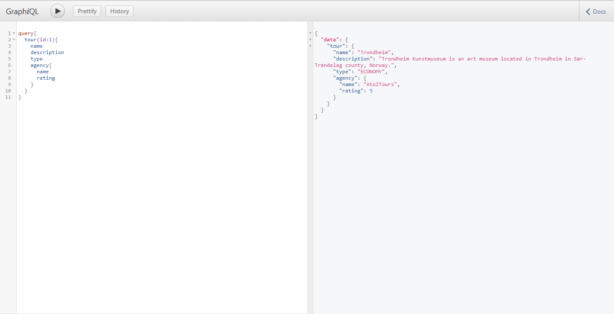

# GraphQL-Spring-boot Application: 

This Standalone Spring boot project demonstrates the crud operations on Tour services using GraphQL as API.


[](https://travis-ci.org/ravisankarchinnam/spring-boot-graphQL)

## 1. In Memory H2 Database is used.
    So you can modify application.properies as per your loving database. 

## 2. Running as a Packaged Application (Following ways)
    Way-1 : java -jar target/spring-boot-graphql-0.0.1-SNAPSHOT.war

    Way-2 : mvn spring-boot:run (using maven)

## 3. Once the application is started you can access http://localhost:8080/graphiql
    

## Testing the Application:

## GraphQL

### To retrieve AllTours:
    ```
    GraphiQL Syntax:
        query {
          allTours {
            name
            type
            description
            agency {
              name
              rating
            }
          }
        }
    
    JSON/postman syntax:
        {
            "query":"{allTours{name type description agency {name rating} }}"
        }
    ```
### To createTour:
    ```
    GraphiQL Syntax:
        mutation {
          createTour(name:"India", price:"34543.43",duration:"3", type:LUXURY,agency:1){
            name
          }
        }
    
    JSON/postman syntax:
        {
        	"query": "mutation createTour {createTour(name:'India', price:'34543.43',duration:'3', type:LUXURY,agency:1){name}}","variables":null,"operationName":"createTour"
        }
    ```
### To retrieve a single Tour:
    ```
    GraphiQL Syntax:
        query {
          tour(id:1){
            name
            description
            type
            agency{
              name
              rating
            }
          }
        }
    
    JSON/postman syntax:
        {
            "query":"{tour(id:1){name description}}"
        }
    ```
## To delete a Tour:
    ```
    GraphiQL Syntax:
        mutation {
          deleteTour(id:10)
        }
    
    JSON/postman syntax:
        {
            "query": "mutation deleteTour {deleteTour(id:4)}","variables":null,"operationName":"deleteTour"
        }
    ```    
## To retrieve allAgencies:
    ```
    GraphiQL Syntax:
        query{
          allAgencies{
            name
          }
        }
    
    JSON/postman syntax:
        {
            "query":"{allAgencies{name rating}}"
        }
    ```
### To retrieve a single Agency:
    ```
    GraphiQL Syntax:
        query {
          agency(id:1){
            name
            rating
          }
        }
    
    JSON/postman syntax:
        {
            "query":"{agency(id:1){name rating}}"
        }
    ```    
## To update Agency rating:
    ```
    GraphiQL Syntax:
        mutation{
          updateAgencyRating(id:1, rating:5){
            rating
            name
          }
        }
    
    JSON/postman syntax:
        {
        	"query":"mutation updateAgencyRating {updateAgencyRating(id:1, rating:2){name rating}}", "operationName": "updateAgencyRating"
        }
    ```
## REST:

    Swagger UI is configured in this application to provide rest endpoints. So if you want to test the services using REST URL's,
    you can visit http://localhost:8080/swagger-ui.html
    
    Tour: http://localhost:8080/api/rest/tour/
    Agency: http://localhost:8080/api/rest/agency/